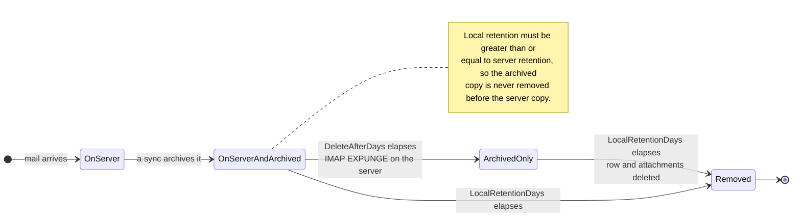

# 🗑️ Retention Policies

[← Back to Documentation Index](index.md)

## Overview

Mail Archiver provides comprehensive retention policy management to help you control storage usage while maintaining compliance requirements. The system supports two types of retention policies:

1. **Server Retention Policy**: Controls automatic deletion of emails from the mail server
2. **Local Archive Retention Policy**: Controls automatic deletion of emails from the local archive

This dual approach gives you fine-grained control over storage management while ensuring data consistency and compliance requirements are met.

## 🗂️ Where a Message Lives

The two policies act on two different copies of the same message, which is why
they are configured independently:

Server retention trims the mailbox; local retention trims the archive. Deleting
from the server does **not** touch the archived copy — that is the entire point of
an archive. The validation rule (local retention must be at least the server
retention) exists so the archive always outlives the mailbox it was taken from.

## Key Features

- **Automatic Cleanup**: Automatic deletion of old emails during sync cycles
- **Detailed Logging**: Comprehensive audit trail of all deletion activities
- **Per-Account Configuration**: Configure retention policies individually for each email account

## Server Retention Policy

### Purpose
The server retention policy automatically deletes emails from the mail server after a specified number of days. 

### Configuration
- **Field**: `Delete After Days`
- **Location**: Email Accounts → Edit → Email Deletion section
- **Values**: Number of days (empty = disabled)

### How It Works
1. During synchronization, the system identifies emails older than the configured retention period
2. Identified emails are marked for deletion on the mail server
3. Deletion is performed using IMAP EXPUNGE command

### Requirements
> 🚨 **Important note for retention policies**
> - Requires IMAP Expunge support from the mail server to permanently delete emails
> - For Gmail accounts, Auto-Expunge must be disabled in Gmail settings under the "Forwarding and POP/IMAP" tab! (See [Gmail Best Practices](GmailBestPractices.md) for more details)

## Local Archive Retention Policy

### Purpose
The local archive retention policy automatically deletes emails from the local archive after a specified number of days. 

### Configuration
- **Field**: `Local Retention Days`
- **Location**: Email Accounts → Edit → Email Deletion section
- **Values**: Number of days (empty = disabled, must be ≥ Server Retention)

### How It Works
1. During synchronization, the system identifies archived emails older than the configured retention period
2. Identified emails are deleted from the local database
3. Associated attachments are also removed
4. A summary log entry is created in Access Logs

### Validation Rules
1. **Server Retention Required**: Local retention can only be configured if server retention is also set
2. **Retention Hierarchy**:te Local rention days must be greater than or equal to server retention days
3. **Safety First**: This prevents emails from being deleted from the local archive before they are deleted from the mail server

## Configuration Steps

### 1. Edit Email Account

1. Navigate to **Email Accounts** → **Edit Account**
2. Scroll to the **Email Deletion** section
3. Set **Delete After Days** (server retention)
4. Set **Local Retention Days** (local archive retention)
5. Save the configuration

## Monitoring and Logging

### Access Logs

All retention policy deletions regarding the local archive are logged in the Access Logs with detailed information:

## Best Practices

### Compliance Considerations

1. **Legal Requirements**: 
   - Research retention requirements for your industry
   - Document retention policies
   - Regular compliance audits

2. **Audit Trails**: 
   - Maintain detailed Access Logs
   - Regular log analysis
   - Export logs for external audits

3. **Documentation**: 
   - Maintain retention policy documentation
   - Regular policy reviews
   - Stakeholder approvals