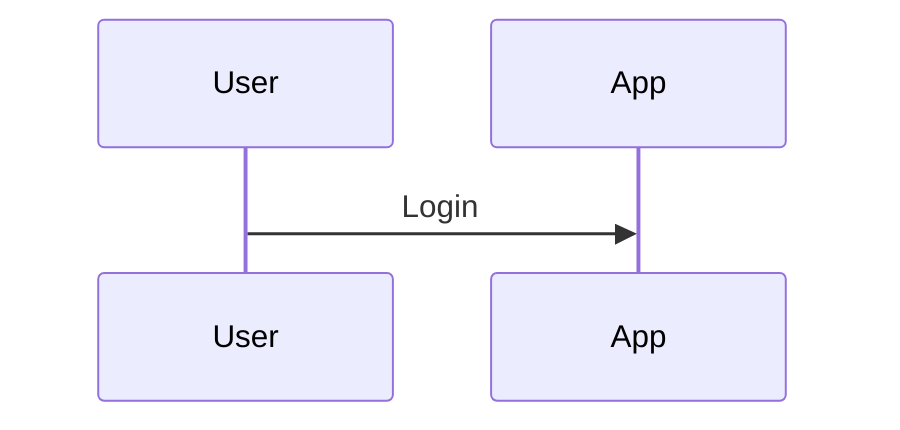

# Documentation tooling

## `gen_api_reference.py`

Renders `doc/API-Reference.md` from the OpenAPI specification in
`doc/assets/openapi-v1.json`.

```bash
python3 tools/gen_api_reference.py          # write the page
python3 tools/gen_api_reference.py --check  # exit 1 if the page is stale (CI)
```

Only the standard library is used, so no extra dependencies are needed.

The page is **generated output**. To change it, change the API or the generator —
never the Markdown file, which is overwritten on the next run. CI runs
`--check`, so a pull request that changes the specification without regenerating
the page fails the build.

## Refreshing the specification

`doc/assets/openapi-v1.json` is a snapshot of the document the application
publishes at `/apidocs/spec/v1.json`. That endpoint sits outside `/api/` and is
gated by the web (cookie) session, so it **cannot be fetched with an API key** —
which is why a snapshot is kept in the repository instead of being fetched
during the docs build.

The snapshot is produced at build time, without running or logging into an
instance, using the ASP.NET Core OpenAPI build task:

1. Add the build-time generator to `MailArchiver.csproj`:

   ```xml
   <PropertyGroup>
     <OpenApiGenerateDocuments>true</OpenApiGenerateDocuments>
     <OpenApiDocumentsDirectory>$(MSBuildProjectDirectory)/obj/openapi</OpenApiDocumentsDirectory>
   </PropertyGroup>
   ```

   ```xml
   <PackageReference Include="Microsoft.Extensions.ApiDescription.Server" Version="10.0.11" />
   ```

2. Build the web project:

   ```bash
   dotnet build MailArchiver.csproj
   ```

3. Copy the result over the snapshot and regenerate the page:

   ```bash
   cp obj/openapi/MailArchiver.json doc/assets/openapi-v1.json
   python3 tools/gen_api_reference.py
   ```

4. Revert the `MailArchiver.csproj` changes — they exist only to produce the
   snapshot and are not meant to be committed.

### Note on endpoint descriptions

The controllers currently carry no XML documentation comments, so the generated
specification has no `summary` or `description` fields and the reference is
type-only. Adding `///` comments to the actions in `Controllers/Api/V1/` and
enabling XML documentation in the project would enrich the page automatically.

## Mermaid diagrams

Mermaid support is enabled through `pymdownx.superfences` in `mkdocs.yml`. Write
diagrams as fenced code blocks:

````markdown

````

Be aware that Material loads the Mermaid library from the unpkg CDN at view
time. On a network without access to `unpkg.com` the diagrams will not render;
self-hosting the library via `extra_javascript` would remove that dependency.
